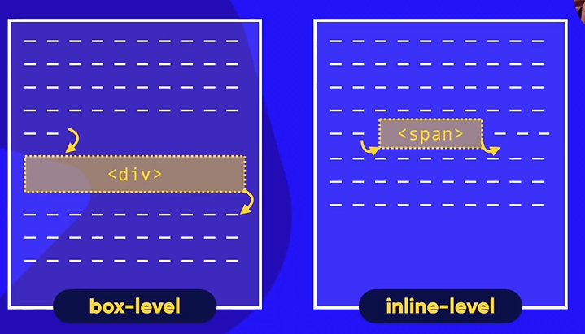
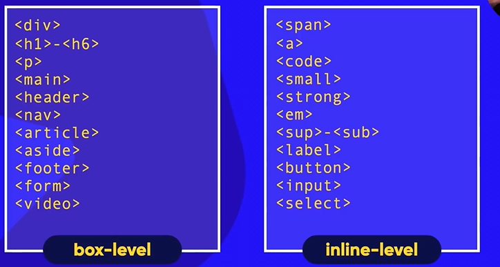

# Box Model e Aninhamento
    - Todo elemento visivel no HTML é uma Caixa
    - Por Exemplo o <h1> é uma caixa
    - Cada caixa tem um height e widht e um border
    - A distância entre a caixa e a borda se chama Padding
        ex:

'''
<h1 style="border: solid; padding: 3px;">Olá, mundo</h1>
'''

    - Existe um espaço entre a borda e o lado de fora
    - O limite se chama de margin e o espaço entre eles se chama de outline (contorno ou tracejado)

    
    - Existem dois tipos de caixas
    - Box-Level:
        - Ela ocupa a largura interia do display, e quando criado pula para a linha de baixo da pagina. (Ex: 
)
    - Inline-level:
        - Ocupa apenas o espaço necessário para manter o conteúdo dentro dele. Ele não pula a linha. (ex:)

